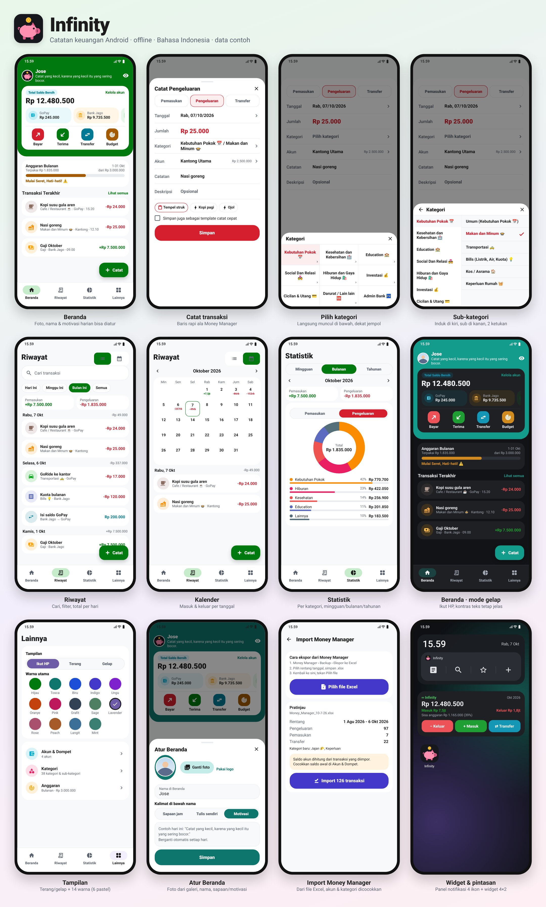

<p align="center"></p>

# Infinity 🐷

Aplikasi catatan keuangan Android yang cara catatnya meniru **Money Manager** (baris Tanggal, Jumlah, Kategori, Akun, panel kategori 3 kolom), dengan tampilan bersih ala **Gojek**, plus fitur yang biasanya tidak ada: **berapa yang aman dibelanjakan hari ini**, **catat otomatis dari notifikasi bank/e-wallet** (termasuk mencocokkan saldo), **baca foto struk offline**, **import dari Money Manager**, widget, dan pintasan di panel notifikasi.

- **APK Android tanpa izin internet.** Data tidak bisa keluar dari HP, disimpan terenkripsi.
- Tampilan **Bahasa Indonesia**, **mode gelap**, dan **14 warna utama** (termasuk 6 pastel).
- Kategori bawaan mengikuti kategori Money Manager yang biasa dipakai, bisa diubah semua.



> Gambar di atas adalah **mockup dengan data contoh** yang digambar ulang mengikuti tampilan app (lihat `tool/mockup/`), bukan screenshot dari HP.

## Pasang di Android (APK)

1. Buka halaman **[Releases](../../releases)** repo ini dari HP.
2. Unduh **`Infinity-v<versi>.apk`** dari rilis paling atas. `Infinity-v<versi>-hp-lama-32bit.apk` hanya untuk HP lama yang gagal memasang versi biasa.
3. Buka file itu. Kalau Android bertanya, izinkan **"Instal aplikasi tidak dikenal"** untuk browser/Files. Kalau Play Protect memperingatkan, pilih **Tetap instal** (wajar untuk APK di luar Play Store).
4. Pertama kali dibuka, izinkan notifikasi supaya pengingat dan pintasan muncul.

Setiap kali `main` diperbarui, GitHub Actions otomatis membangun APK baru dan menerbitkannya di Releases. Nomor versinya naik satu per rilis (v1.6, v1.7, ..., v2.0, v2.1, ...), dan tiap rilis mencantumkan apa yang ditambah, diubah, dihapus, dan diperbaiki (sumbernya [CHANGELOG.md](CHANGELOG.md)).

### Update tanpa kehilangan data

Semua APK ditandatangani dengan **kunci yang sama** (secret `DEBUG_KEYSTORE_BASE64`), jadi versi baru cukup **dipasang di atas** versi lama. Data hilang hanya kalau app di-uninstall, HP di-reset, atau memasang APK yang ditandatangani kunci lain. Untuk jaga-jaga, lihat [Backup & pulihkan](#backup--pulihkan).

## Fitur

### Beranda: yang penting langsung terlihat
- **Aman dibelanjakan hari ini**: angka pertama yang muncul saat app dibuka. Kalau anggaran diatur, sisa anggaran dibagi sisa hari. Kalau belum, dihitung dari saldo e-wallet, tunai, dan bank, dikurangi tagihan kartu kredit, utang jatuh tempo, setoran target tabungan, serta tagihan berulang sampai akhir bulan. Ketuk untuk melihat rinciannya.
- **Perlu perhatian**: kartu untuk tagihan dan utang yang jatuh tempo ≤3 hari, target tabungan yang tenggatnya dekat, pengeluaran yang sedang tidak biasa (7 hari terakhir > 2× rata-rata mingguan), **langganan yang terdeteksi** (nominal mirip 3 bulan berturut, bisa dijadikan transaksi berulang), dan **saldo yang tidak cocok** dengan notifikasi bank/e-wallet.
- **Ringkasan bulanan**: pengeluaran bulan ini dibanding bulan lalu pada tanggal yang sama, plus kategori yang naik paling banyak.

### Catat transaksi (ala Money Manager)
- Tab **Pemasukan · Pengeluaran · Transfer**, lalu baris **Tanggal, Jumlah, Kategori, Akun, Catatan, Deskripsi**.
- Selesai mengisi nominal, panel **kategori** langsung terbuka di bawah (dekat jempol, tanpa animasi). Grid 3 kolom; kategori yang punya sub membelah layar: induk di kiri, sub di kanan. Cukup 2 ketukan.
- **Kalkulator** di kolom Jumlah, **template catat cepat** (mis. "Kopi pagi"), dan **Tempel struk**: salin teks struk/notifikasi, nominal, akun, dan kategorinya ditebak otomatis.
- **Foto struk**: dari kamera atau galeri. Kalau nominal masih kosong, struknya **dibaca otomatis di HP** (Google ML Kit, tanpa internet) untuk mengisi total, nama toko, dan kategori.
- **Saran dari ketikan sebelumnya** di Catatan dan Deskripsi (ketik "pot", muncul "Potong rambut").
- Setelah tersimpan: **edit, duplikat, salin teks transaksi**, atau hapus (geser) dengan tombol Urungkan.

### Akun & transfer
- Akun **E-Wallet, Tunai, Rekening Bank, Kartu Kredit** (limit + tanggal jatuh tempo), **Investasi**.
- **Transfer** antar akun, termasuk beda mata uang (IDR, USD, SGD, MYR, CNY, TWD, AUD, EUR, JPY) dengan kurs yang bisa diubah.
- Saldo dihitung ulang dari saldo awal + semua transaksi, jadi edit/hapus selalu konsisten. Mengubah saldo manual dicatat sebagai transaksi *Penyesuaian saldo* (seperti "Modified Bal." di Money Manager).
- **Ketuk akun** untuk melihat riwayatnya per bulan, dengan saldo setelah tiap transaksi.
- Urutan akun bisa diatur, dan ada **akun default** untuk transaksi baru.

### Patungan, acara & perkiraan
- **Patungan**: bayar dulu, bagianmu jadi pengeluaran, bagian teman jadi piutang lewat akun *Talangan Patungan*.
- **Acara**: tandai transaksi ke acara (mis. "Trip Bali") untuk melihat total dan anggarannya.
- **Kekayaan bersih per bulan** di Statistik, dan **perkiraan saldo akhir bulan** per akun dari transaksi berulang.

### Utang, piutang & target tabungan
- **Utang & Piutang**: siapa meminjam berapa, tenggat, cicilan, tandai lunas, dengan pengingat.
- **Target Tabungan**: progres dari saldo akun atau setoran manual, dan berapa yang perlu disisihkan per bulan.

### Kategori
Bawaannya kategori Money Manager yang biasa dipakai, misalnya Kebutuhan Pokok 📅 (Makan dan Minum, Transportasi, Bills, Kos, Keperluan Rumah), Kesehatan dan Kebersihan 🏥, Education 🏫, Social Dan Relasi 💑, Hiburan dan Gaya Hidup 🛍️, Investasi 💰, Cicilan & Utang 💳, Darurat / Lain lain 🆘, Admin Bank 🏧, dan sisi pemasukan (Main Income, Gift / Support, Passive Income, Cashback / Refund). Semua bisa ditambah, diubah, dan dihapus, lengkap dengan sub-kategori.

### Riwayat, kalender, statistik, anggaran
- **Rekap tahunan** (Statistik): total setahun, porsi yang ditabung, bulan paling boros/hemat, kategori terbesar, pengeluaran terbesar, dan kekayaan bersih awal vs akhir tahun.
- **Riwayat**: cari, filter Hari Ini / Minggu Ini / Bulan Ini / Semua, total per hari.
- **Kalender**: pemasukan dan pengeluaran per tanggal.
- **Statistik**: mingguan/bulanan/tahunan, donut per kategori, selisih bersih, rata-rata pengeluaran per hari.
- **Anggaran**: total dan per kategori, dengan status *Aman*, *Mulai Seret*, atau *Jebol*.

### Transaksi berulang & notifikasi
Gaji, kos, langganan, cicilan: harian, mingguan, bulanan, tahunan. Tercatat otomatis saat jatuh tempo. Notifikasi (bisa diatur satu per satu):

| Notifikasi | Kapan |
|---|---|
| Transaksi berulang | sehari sebelum (bulanan/tahunan) dan saat jatuh tempo |
| Tagihan kartu kredit | 3 hari sebelum dan saat jatuh tempo |
| Peringatan anggaran | saat status berubah jadi Seret atau Jebol |
| Pengingat harian | setiap hari, jam bisa diatur (bawaan 20.00) |

Nominal di notifikasi disembunyikan secara bawaan.

### Catat otomatis dari notifikasi bank & e-wallet
Infinity membaca notifikasi yang berisi nominal "Rp" dari GoPay, OVO, DANA, ShopeePay, LinkAja, myBCA/BCA, Jago, BRImo, Livin Mandiri, BNI, SeaBank, blu, dan Flip, lalu:
- **Langsung catat** kalau akunnya bisa ditebak (beri nama akun yang memuat nama aplikasinya, mis. "GoPay", "BCA").
- Masuk ke kartu **Dari Notifikasi** di Beranda kalau akunnya tidak jelas atau sepertinya sudah kamu catat manual (nominal dan akun sama dalam 10 menit).
- **Isi saldo / top up** e-wallet tidak dicatat sebagai pengeluaran, tapi masuk ke *Dari Notifikasi* sebagai transfer dari rekening bank ke e-wallet.
- **Cocokkan saldo**: kalau notifikasi menyebut saldo ("Saldomu sekarang: Rp…", "Sisa saldo Rp…"), Infinity membandingkannya dengan saldo di app pada jam itu. Kalau beda, muncul kartu dengan tombol *Samakan*.
- Notifikasi promo diabaikan. Mode: Mati / Tanya dulu / Langsung catat.

Android 13+ memblokir akses notifikasi untuk APK di luar Play Store. Caranya: coba aktifkan sekali, lalu buka **Info aplikasi Infinity → ⋮ → Izinkan setelan terbatas**, dan aktifkan lagi. Panduannya ada di halaman Catat Otomatis.

### Pintasan & widget
- **Pintasan di panel notifikasi** (seperti Money Manager): ikon **Riwayat, Cari, Template, ＋**. Bisa dimatikan di Lainnya → Notifikasi.
- **Widget 4×2** di layar utama: saldo bersih, masuk/keluar bulan ini, sisa anggaran, dan tombol **Keluar · Masuk · Transfer**. Ikut mode gelap HP.

### Tampilan & Beranda
- **Ikut HP / Terang / Gelap**. Warna di mode gelap dihitung ulang supaya teks tetap terbaca (kontras teks minimal 4,5:1).
- **Warna utama**: Hijau, Tosca, Biru, Indigo, Ungu, Oranye, Pink, Grafit, dan pastel Sage, Lavender, Rose, Peach, Langit, Mint. Pemasukan tetap hijau dan pengeluaran tetap merah apa pun warnanya.
- **Atur Beranda** (ketuk logo/nama): foto dari galeri, nama, dan kalimat di bawah nama: sapaan sesuai jam, tulis sendiri, atau **motivasi harian** (30 kalimat, berganti tiap hari, tanpa internet).

### Import dari Money Manager
Lainnya → **Import dari Money Manager** → pilih file `.xlsx` hasil *Money Manager › Backup › Ekspor ke Excel*.
- Pratinjau dulu: rentang tanggal, jumlah pengeluaran/pemasukan/transfer, akun dan kategori baru.
- Akun dan kategori dicocokkan berdasarkan nama, tanpa peduli emoji, spasi, atau keterangan dalam kurung ("Health (Obat , Vitamin)💊" = "Health (Obat, Vitamin) 💊"). Yang belum ada dibuat otomatis.
- `Transfer-Out` jadi transfer antar akun. Import file yang sama dua kali **tidak** membuat transaksi dobel.
- File ekspor tidak berisi saldo awal, jadi setelah import cocokkan saldo awal tiap akun di **Akun & Dompet**.

## Keamanan

- **Tanpa izin INTERNET** di APK: secara teknis app tidak bisa mengirim data ke mana pun.
- Data disimpan di file terenkripsi **AES-256-GCM** di folder pribadi app; kuncinya di Android Keystore. `allowBackup` dimatikan.
- Library baca struk (ML Kit) membawa izin INTERNET untuk log pemakaian Google; izin itu dibuang di manifest, dan CI menolak build yang masih punya izin INTERNET.
- **PIN** + **sidik jari/wajah**. Diminta saat app dibuka dan saat kembali setelah 30 detik di latar belakang. Salah 5 kali = jeda 30 detik.
- **Mode layar aman** (opsional): sembunyikan isi app di daftar aplikasi terbaru dan blokir screenshot.
- Yang tetap perlu dijaga: backup `.json` di folder Download **tidak terenkripsi** (atur kata sandi backup supaya jadi `.infb`), dan file kunci `DEBUG_KEYSTORE_BASE64` jangan dibagikan.

## Backup & pulihkan

Lainnya → **Backup & Pulihkan**:
- **Backup otomatis mingguan** ke `Download/Infinity/`. File ini tetap ada walau app di-uninstall. Disimpan 8 backup terakhir, dan setiap backup dicoba dibuka dulu sebelum disimpan. Bisa dimatikan, atau tekan **Backup sekarang**.
- **Kata sandi backup**: kalau diatur, backup jadi file `.infb` terenkripsi (AES-256) yang ikut menyimpan foto struk. Tanpa kata sandi, backup berupa `.json` biasa.
- **Simpan ke Google Drive**: lewat layar simpan Android (Drive yang meng-upload, Infinity tetap tanpa internet). Selalu `.infb` terkunci kata sandi.
- **Pulihkan dari file**: pilih `.infb` atau `.json` dari HP atau Google Drive.
- **Ekspor ke Excel** (bulan ini, tahun ini, atau semua) dengan kolom seperti ekspor Money Manager.
- **Salin backup**: data sebagai teks JSON ke clipboard (dihapus otomatis dari clipboard setelah 60 detik).
- **Pulihkan**: tempel isi JSON. PIN dan setelan keamanan tidak ikut ditimpa.
- **Reset semua data**: harus mengetik `HAPUS` dulu supaya tidak terpencet.
- **Pindah HP**: langkahnya ada di halaman Backup & Pulihkan dan di Bantuan.

## Perawatan

Lainnya → bagian bawah:
- **Bantuan**: FAQ (catat otomatis, backup, lupa PIN, kurs, patungan) dan langkah pindah HP.
- **Cek kesehatan data**: mencari transaksi dobel, kategori yang sudah dihapus (bisa diperbaiki sekali tekan), saldo minus yang tidak wajar, talangan patungan yang tidak cocok, dan backup yang sudah lama.
- **Laporan error**: error app dicatat ke file lokal (tidak dikirim ke mana pun). Simpan ke Download lalu kirim filenya kalau ada masalah.

## Build sendiri

APK dibangun oleh `.github/workflows/build-apk.yml`:

1. `tool/ci_setup.sh` membuat proyek Flutter baru dan memasang paket dengan **versi terkunci**: versi Flutter dan paket langsung ada di `tool/versions.env`, dependensi tidak langsung dikunci lewat `tool/pubspec.lock` (`flutter pub get --enforce-lockfile`). Jadi build ulang kapan pun hasilnya sama.
2. `tool/setup_android.py` menyalin `android_overlay/` (Kotlin, manifest, widget, ikon, tema) dan menyetel Gradle (desugaring, minSdk 24, tanda tangan dari `INFINITY_KEYSTORE`).
3. `flutter test` (tes saldo, import, backup, pembacaan notifikasi, dll.), `flutter analyze`, lalu `flutter build apk --release --split-per-abi`.
4. APK dicek: harus tanpa izin INTERNET, dan semua library native rata 16 KB (`tool/check_apk.py`, syarat HP Android 15+ dengan halaman memori 16 KB).
5. APK diterbitkan di Releases. Kalau gagal, log `test.txt`/`analyze.txt`/`build.txt` disimpan di branch **`ci-logs`**.

Branch selain `main` hanya dites (workflow *Tes branch*, tanpa rilis); hasilnya (log, `pubspec.lock`, versi Flutter) disimpan di branch **`ci-out`**.

Secret yang dipakai: **`DEBUG_KEYSTORE_BASE64`** (keystore dalam base64, alias `androiddebugkey`, password `android`, sidik jari SHA-256 diawali `4F338CE994351349`). Tanpa secret ini APK tetap jadi, tapi tiap build punya tanda tangan berbeda.

### Kalau secret keystore hilang

Simpan file `infinity.keystore` di tempat aman di luar GitHub. Untuk memasangnya lagi: buat base64-nya (`base64 -w0 infinity.keystore` di Linux/Mac, atau `certutil -encode` di Windows lalu buang baris header/footer), lalu isi ke **Settings → Secrets and variables → Actions → `DEBUG_KEYSTORE_BASE64`**. APK berikutnya kembali bisa dipasang di atas versi lama tanpa hapus data.

### Memperbarui versi Flutter/paket

Kosongkan `FLUTTER_VERSION` dan nomor versi di `tool/versions.env`, hapus `tool/pubspec.lock`, lalu push ke branch lain (bukan `main`). Ambil `pubspec.lock` dan versi Flutter dari branch `ci-out`, isi kembali ke `tool/`, pastikan tesnya lolos, baru gabung ke `main`.

Di PC: butuh Flutter 3.47.6 dan Android SDK. Jalankan `bash tool/ci_setup.sh android`, lalu `flutter test` dan `flutter build apk --release --split-per-abi`.

## Keputusan desain

- **Satu library Dart, dipecah per bagian.** `lib/main.dart` memuat `lib/src/*.dart` sebagai `part`, jadi tetap satu library (bisa saling akses) tapi tiap bagian punya file sendiri.
- **Tanpa server dan tanpa login bank.** Sinkron bank langsung tidak realistis untuk pemakaian pribadi di Indonesia, jadi yang dipakai adalah pembacaan notifikasi.
- **Angka di bawah 1.000 tanpa satuan dianggap ribuan** saat membaca teks cepat ("25 nasgor" = Rp25.000), karena nominal Rupiah sekecil itu hampir tidak pernah dipakai.
- **Transfer-In dari Money Manager dilewati**, karena pasangannya (Transfer-Out) sudah dicatat sebagai satu transfer.
- **Pemilih file memakai pemilih bawaan Android** (bukan paket `file_picker`), karena `file_picker` 13 butuh Android SDK 37 yang belum didukung alat build Flutter.
- **Warna di mode gelap** dihitung ulang, bukan dibalik, supaya tombol berwarna dengan tulisan putih tetap terbaca.

## Belum dites di HP sungguhan

- Pembacaan notifikasi bank/e-wallet masih tebakan berdasarkan pola umum. Kalau ada notifikasi yang salah terbaca, kirim contoh teksnya.
- Tampilan widget dan pintasan notifikasi bisa sedikit berbeda antar merek HP (Xiaomi/Oppo/Vivo juga perlu Baterai: *Tanpa batasan* supaya pengingat tepat waktu).

## Struktur folder

```
lib/main.dart                     titik masuk; memuat lib/src/*.dart sebagai part
lib/src/                          kode per bagian (model, penyimpanan, Beranda, form, import, insight, ...)
tests/                            tes otomatis (dijalankan CI sebelum build)
android_overlay/app/src/main/
  AndroidManifest.xml             izin, listener notifikasi, widget
  kotlin/.../MainActivity.kt      channel native: layar aman, akses notifikasi, simpan ke Download, pilih file
  kotlin/.../NotificationCaptureService.kt   tangkap notifikasi berisi "Rp"
  kotlin/.../QuickBar.kt          notifikasi pintasan 4 ikon
  kotlin/.../InfinityWidgetProvider.kt       widget 4x2
  res/                            layout widget & pintasan, ikon celengan, warna terang/gelap
tool/versions.env                 versi Flutter & paket yang dikunci
tool/pubspec.lock                 kunci semua dependensi
tool/ci_setup.sh                  siapkan proyek Flutter (dipakai semua workflow)
tool/check_apk.py                 cek library native rata 16 KB
tool/setup_android.py             pasang android_overlay ke proyek hasil flutter create
tool/make_icons.py                gambar ikon celengan (vector adaptif + PNG)
tool/mockup/                      generator gambar mockup di README
docs/                             ikon & mockup untuk README
.github/workflows/build-apk.yml   build APK + rilis + simpan log kegagalan
```
